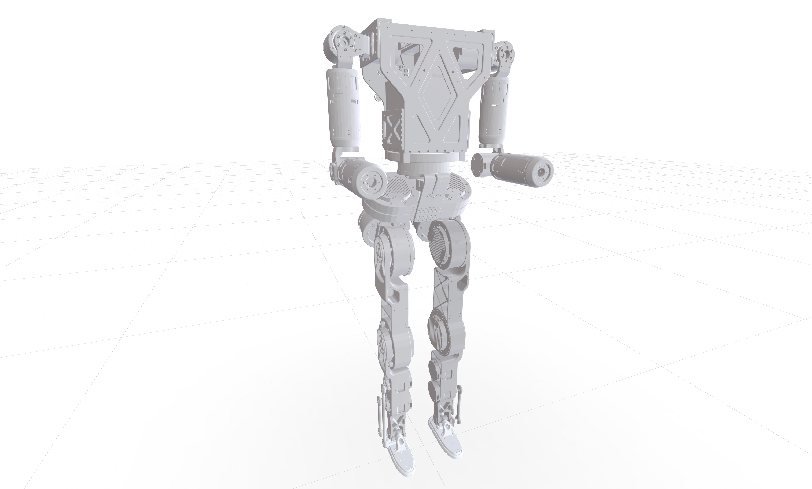

There are the description files of RPO, a product of Roboparty.

## License

Unless an individual file states otherwise, RoboParty-owned URDF, XML, STL and
related hardware-description materials are licensed under
[CERN-OHL-W-2.0](./LICENSE). The Source Location for Covered Source is
<https://github.com/Roboparty/rpo_description>. Third-party material remains
under its original terms and is not relicensed merely because it is present in
this repository.
